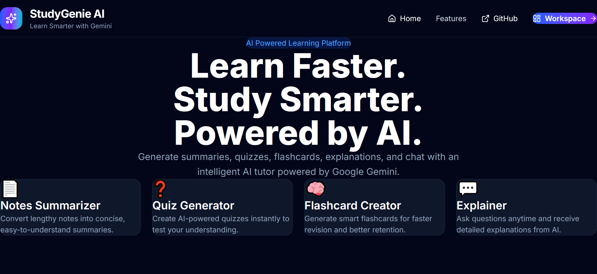
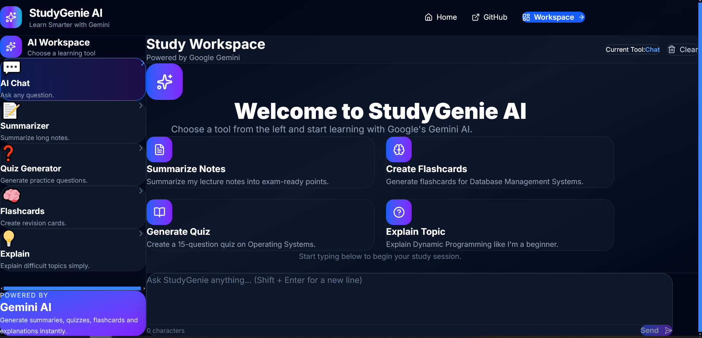
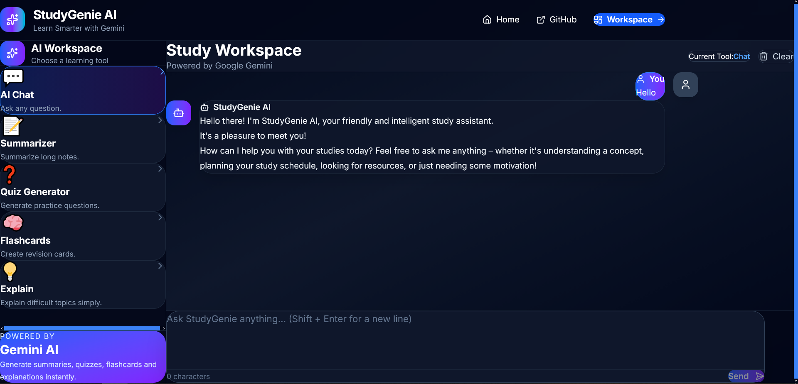
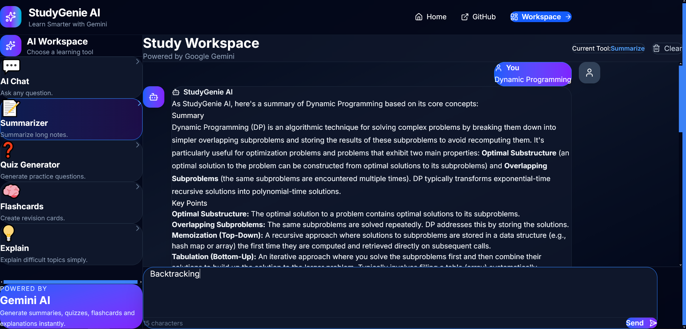
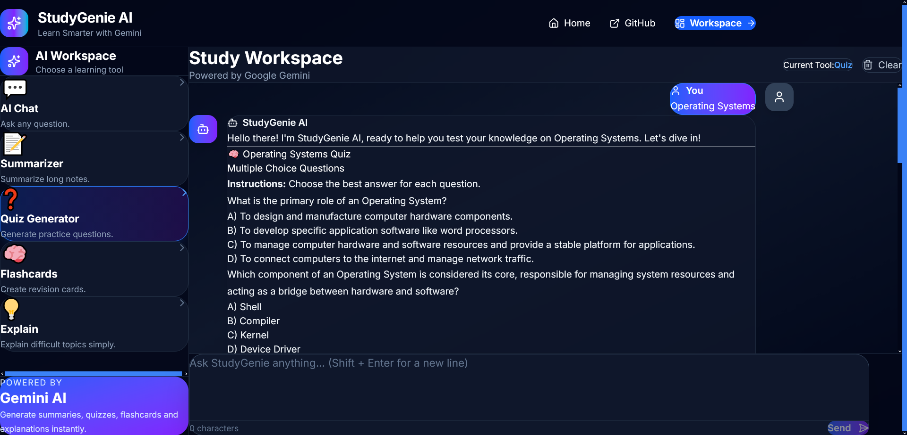

# 🎓 StudyGenie AI

<p align="center">
  
  
  
  
  
  
</p>

<p align="center">
A modern AI-powered study assistant built with React, Node.js, Express, and Google Gemini.
</p>

---

# 🚀 Live Demo

### 🌐 Frontend

https://study-genie-ai-orpin.vercel.app/

### ⚙️ Backend API

https://studygenie-backend-q6tk.onrender.com

---

# ✨ Features

- 💬 AI Chat Assistant
- 📝 Notes Summarizer
- ❓ Quiz Generator
- 🧠 Flashcard Generator
- 💡 AI Concept Explainer
- ⚡ Gemini 2.5 Flash Integration
- 📱 Fully Responsive Design
- 🔒 Secure Backend API
- 🐳 Docker Support
- ☁️ Cloud Deployment
- 🚀 AWS Ready

---

# 📸 Application Preview

## Landing Page

<p align="center">

</p>

---

## Workspace

<p align="center">

</p>

---

## AI Chat Assistant

<p align="center">

</p>

---

## Notes Summarizer

<p align="center">

</p>

---

## Quiz Generator

<p align="center">

</p>

---

# 🛠️ Tech Stack

## Frontend

- React 19
- Vite
- Tailwind CSS
- React Router
- Axios
- React Markdown
- Lucide React
- React Hot Toast

## Backend

- Node.js
- Express.js
- dotenv
- CORS

## AI

- Google Gemini 2.5 Flash API

## Deployment

- Vercel
- Render

## Containerization

- Docker
- Docker Compose

---

# 📁 Folder Structure

```text
StudyGenie-AI/
│
├── client/
├── server/
├── screenshots/
├── docker-compose.yml
├── README.md
└── .gitignore
```

---

# ⚙️ Installation

## Clone Repository

```bash
git clone https://github.com/YusufKhan2313110/StudyGenie-AI.git

cd StudyGenie-AI
```

---

## Install Backend

```bash
cd server
npm install
```

---

## Install Frontend

```bash
cd ../client
npm install
```

---

# 🔑 Environment Variables

## Backend (.env)

```env
GEMINI_API_KEY=YOUR_GEMINI_API_KEY
PORT=5000
```

## Frontend (.env)

### Local

```env
VITE_API_URL=http://localhost:5000/api
```

### Production

```env
VITE_API_URL=https://studygenie-backend-q6tk.onrender.com/api
```

---

# ▶️ Running Locally

## Backend

```bash
cd server
npm start
```

## Frontend

```bash
cd client
npm run dev
```

Frontend

```text
http://localhost:5173
```

Backend

```text
http://localhost:5000
```

---

# 🐳 Docker

Run the complete application using Docker Compose.

```bash
docker compose up --build
```

Frontend

```text
http://localhost:3000
```

Backend

```text
http://localhost:5000
```

---

# 🏗️ Architecture

```text
             User
               │
               ▼
      React + Vite Frontend
               │
         Axios HTTP Requests
               │
               ▼
      Express.js Backend API
               │
      Google Gemini 2.5 Flash
               │
               ▼
      AI Generated Response
               │
               ▼
            React UI
```

---

# 🔒 Security

- Environment Variables
- Secure Backend API
- Hidden Gemini API Key
- HTTPS Deployment
- CORS Enabled
- `.gitignore` for Sensitive Files

---

# 📦 Deployment

Frontend

- Vercel

Backend

- Render

The project is fully Dockerized and can be deployed to AWS App Runner after AWS account activation.

---

# 📚 Future Improvements

- User Authentication
- Chat History
- PDF Upload
- Voice Input
- Image Analysis
- Multi-language Support
- Export Notes as PDF
- Study Planner
- AWS Deployment

---

# 👨‍💻 Author

**Yusuf Khan**

B.Tech Information Technology

Ajay Kumar Garg Engineering College (AKGEC)

IBM CSRBOX GenAI Vibe Coding Internship

---

## ⭐ Support

If you found this project useful, consider giving it a ⭐ on GitHub.