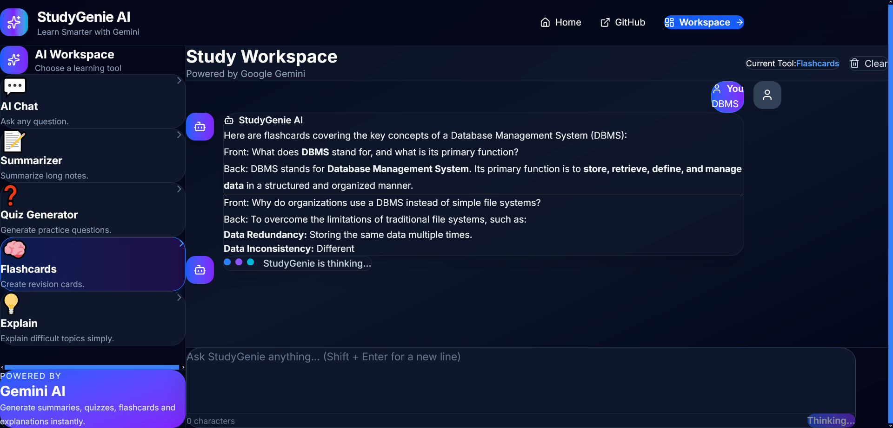

````markdown
# 🎓 StudyGenie AI

<p align="center">
  
  
  
  
  
</p>

<p align="center">
A modern AI-powered study assistant built with React, Node.js, Express, Google Gemini 2.5 Flash, Docker, and deployed on Amazon EC2.
</p>

---

# 🚀 Live Demo

### 🌐 Live Application (AWS EC2)

**URL:** http://44.203.16.127

---

# ✨ Features

- 💬 AI Chat Assistant
- 📝 Notes Summarizer
- ❓ Quiz Generator
- 🧠 Flashcard Generator
- 💡 AI Concept Explainer
- ⚡ Google Gemini 2.5 Flash Integration
- 🌊 Real-time Streaming AI Responses
- 📱 Fully Responsive Design
- 🔒 Secure Backend API
- 🔐 Environment Variable Protection
- 🐳 Docker Containerization
- ☁️ AWS EC2 Cloud Deployment

---

# 📸 Application Preview

## Landing Page

<p align="center">
  
</p>

---

## Workspace

<p align="center">
  
</p>

---

## AI Chat Assistant

<p align="center">
  
</p>

---

## Real-time Streaming Response

<p align="center">
  
</p>

---

## Notes Summarizer

<p align="center">
  
</p>

---

## Quiz Generator

<p align="center">
  
</p>

---

# 🛠️ Tech Stack

## Frontend

- React 19
- Vite
- Tailwind CSS
- React Router
- Axios
- React Markdown
- Lucide React
- React Hot Toast

## Backend

- Node.js
- Express.js
- dotenv
- CORS

## AI Model

- Google Gemini 2.5 Flash API

## Deployment

- Amazon EC2
- Docker
- Docker Compose

---

# 📁 Folder Structure

```text
StudyGenie-AI/
│
├── client/
├── server/
├── screenshots/
├── docs/
├── docker-compose.yml
├── README.md
└── .gitignore
```

---

# ⚙️ Installation

## Clone Repository

```bash
git clone https://github.com/YusufKhan2313110/StudyGenie-AI.git

cd StudyGenie-AI
```

---

## Install Backend

```bash
cd server
npm install
```

---

## Install Frontend

```bash
cd ../client
npm install
```

---

# 🔑 Environment Variables

## Backend (.env)

```env
GEMINI_API_KEY=YOUR_GEMINI_API_KEY
PORT=5000
```

## Frontend (.env)

### Local Development

```env
VITE_API_URL=http://localhost:5000/api
```

### AWS Deployment

```env
VITE_API_URL=http://YOUR_EC2_PUBLIC_IP:5000/api
```

---

# ▶️ Running Locally

## Backend

```bash
cd server
npm start
```

## Frontend

```bash
cd client
npm run dev
```

Frontend

```text
http://localhost:5173
```

Backend

```text
http://localhost:5000
```

---

# 🐳 Docker Deployment

Run the complete application using Docker Compose.

```bash
docker compose up --build -d
```

Frontend

```text
http://localhost
```

Backend

```text
http://localhost:5000
```

---

# 🏗️ System Architecture

```text
                 User
                   │
                   ▼
        React + Vite Frontend
                   │
          Axios HTTP Requests
                   │
                   ▼
         Express.js Backend API
                   │
                   ▼
     Google Gemini 2.5 Flash API
                   │
      Streaming AI Responses
                   │
                   ▼
          React User Interface
```

---

# 🔒 Security

- Environment Variables for API Keys
- Secure Backend API
- Hidden Gemini API Key
- CORS Enabled
- Sensitive files excluded using `.gitignore`

---

# 📦 AWS Deployment

The application is deployed on an **Amazon EC2** instance using **Docker** and **Docker Compose**.

Deployment includes:

- React Frontend Container
- Express Backend Container
- Google Gemini API Integration
- Environment Variable Configuration
- Public AWS Access

**Live URL**

http://44.203.16.127

---

# 📚 Future Improvements

- User Authentication
- Chat History
- PDF Upload & Analysis
- Voice Input
- Image Analysis
- Multi-language Support
- Export Notes as PDF
- Study Planner
- HTTPS with Custom Domain

---

# 👨‍💻 Author

**Yusuf Khan**

B.Tech Information Technology

Ajay Kumar Garg Engineering College (AKGEC)

IBM CSRBOX GenAI Vibe Coding Internship

---

## ⭐ Support

If you found this project useful, consider giving it a ⭐ on GitHub.
````
